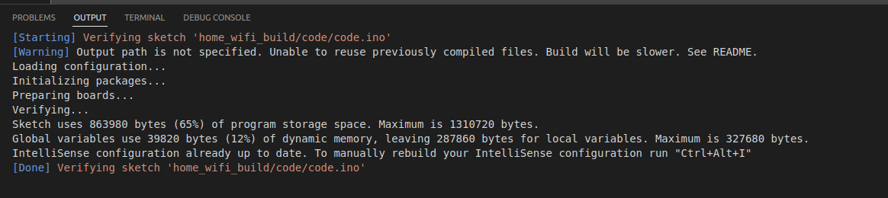
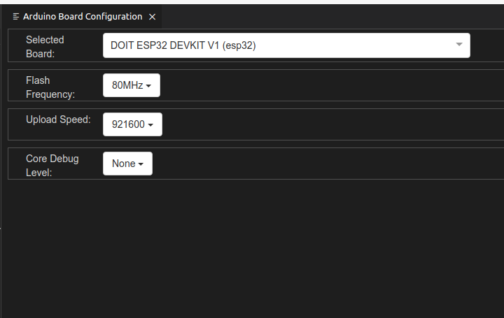
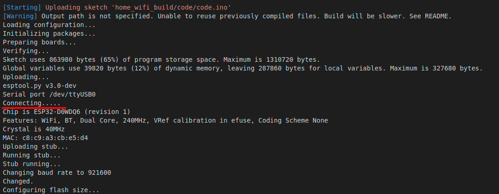
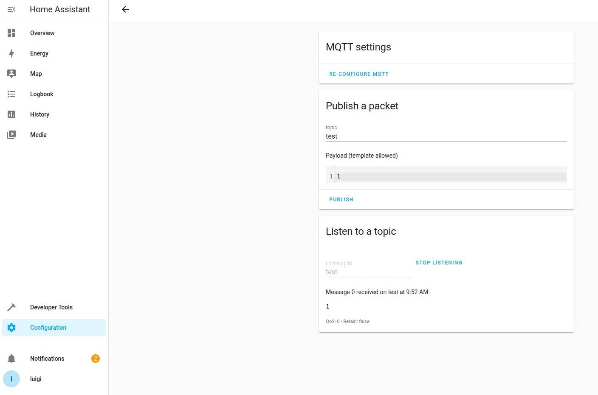
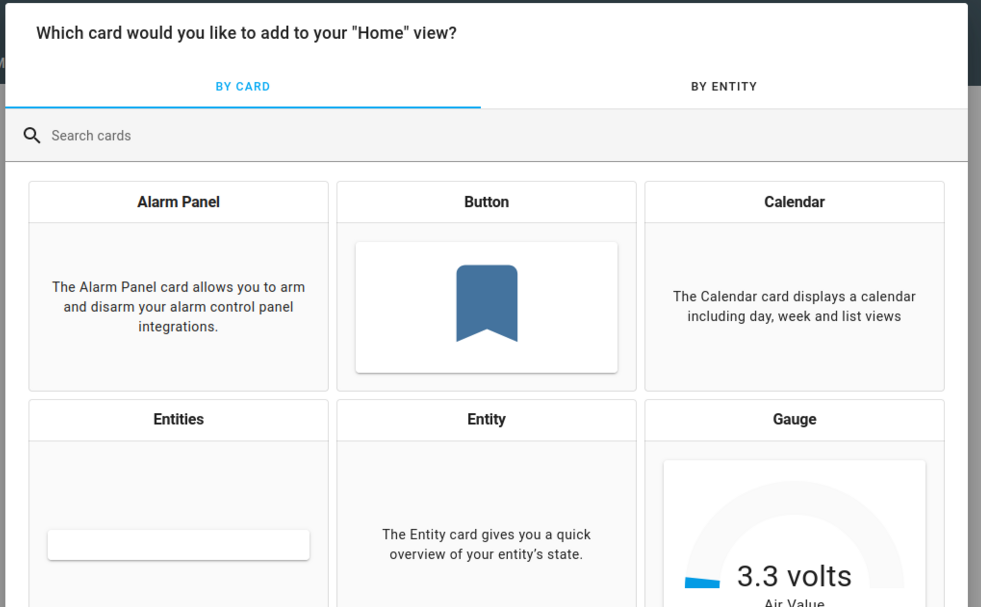
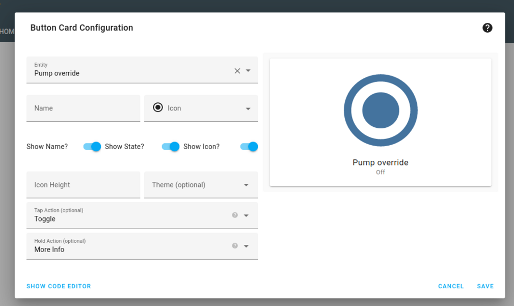
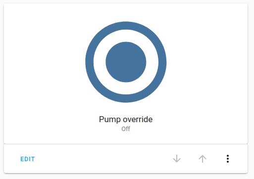
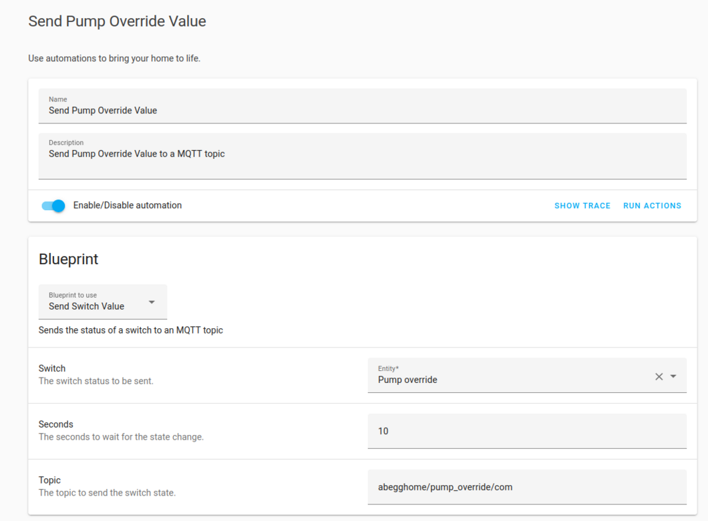
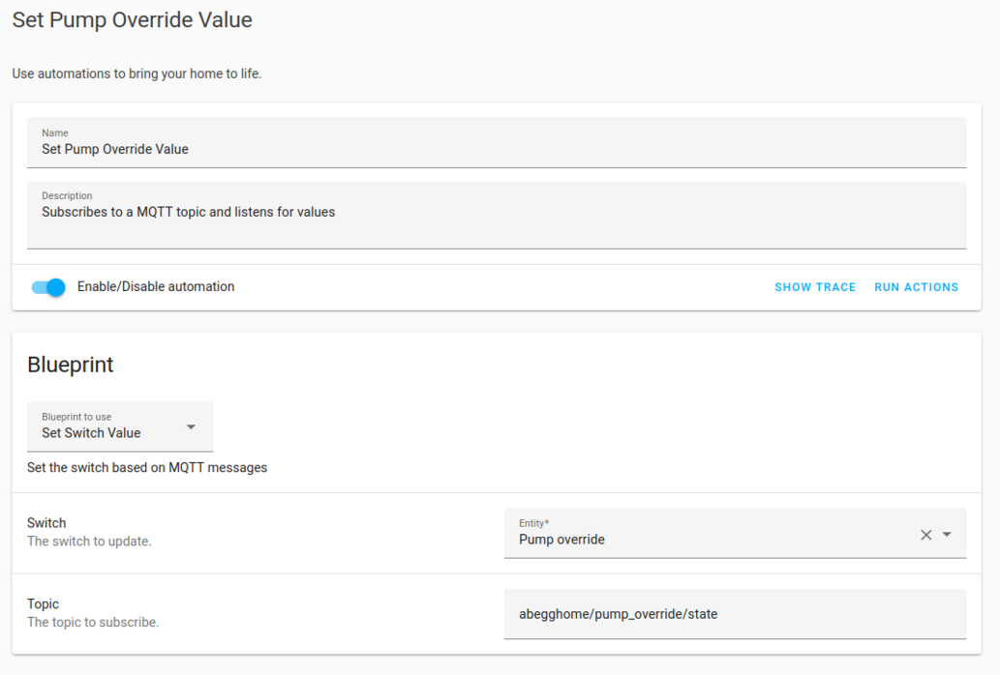

# Versione casalinga

In questa cartella è raccolto il codice per far funzionare il progetto casalingo, che sfrutta la scheda ESP32 per comunicare con il wifi di casa.

## Perchè usiamo la scheda ESP32 invece di Arduino?

Perchè la scheda ESP32 consente di fare le stesse cose, ma ha in più un modulo WiFi e un modulo Bluetooth integrati. A dire il vero, è più potente di Arduino, in quanto è dual core e possiede una memoria flash. In pratica ha tutto quello che ci serve in una soluzione compatta.

## Componenti da acquistare

Di seguito vi proponiamo le componenti minime da acquistare per realizzare il progetto. I link sono solo dei riferimenti su cosa acquistare, qualunque componente equivalente andrà bene:

- ESP 32 Devkit V1 (attenzione a comprare il Devkit V1 e non altre versioni)
    - [Migliore](https://www.dfrobot.com/product-2231.html) questa scheda ha il minor consumo di corrente mentre è in ibernazione. Unico downside, ha bisogno di 1 relay in più, quindi un tot di 2 relay.
    - [Opzione 2](https://amzn.to/3I1UWo7)
    - [Opzione 3](https://bit.ly/3rLBN3c) (può impiegare qualche settimana ad arrivare)
    - [Opzione con GSM](https://makeradvisor.com/ttgo-t-call-esp32-with-sim800l-gsm-gprs/) utile per connettersi con la rete del cellulare
    - In generale, ci sono molte schede che usano il processore ESP32, alcune sono più indicate di altre per essere usate con la batteria come in questo progetto, trovate un'opinione più completa in merito [in questo video](https://www.youtube.com/watch?v=-769_YIeGmI)
- [Cavi, breadboard etc.](https://amzn.to/3I0vpMa)
    - Se oltre agli accessori volete anche un Arduino Uno (usato al posto della ESP 32 nel progetto dell'ufficio, ed è anche molto più user friendly), vi suggeriamo di prendere invece [questo kit](https://amzn.to/3qS6Tag)
- [Sensore di umidità](https://amzn.to/33fi18c) (attenzione a quale sensore prendete, questo che proponiamo è resistente alla corrosione)
- [Pompe per l'acqua](https://amzn.to/33sKqHE)
- Qualunque set di relay va bene, ad esempio [Relay](https://amzn.to/3tpK53x) ma se pensate che ve ne servano di meno si trovano molti prodotto equivalenti. Per questo progetto ne serve 1 oppure 2 se scegliete la scheda all'opzione _migliore_
- Batterie al litio, le normali batterie alcaline non hanno un output di corrente sufficiente
  - Se scegliate la prima scheda (opzione _migliore_), questa scheda ha già installato un connettore JST per collegare una batteria al litio come ad esempio [questa ai polimeri di litio](https://www.amazon.it/gp/product/B08214DJLJ/ref=ppx_yo_dt_b_asin_title_o04_s00?ie=UTF8&psc=1) (è quella che sto usando al momento)
  - Altrimenti, potete comprare delle normali batterie agli ioni di litio formato 18650 oppure 21700
- Nastro isolante nero, lo trovate al supermercato oppure al Brico
- (Opzionale) Un Raspberry Pi 2 Modello B, o versione successiva.

# Guida

In questa guida vi spieghiamo come impostare il vostro giardino autonomo utilizzando la scheda ESP32, il protoccolo MQTT e il software Home Assistant.

- [Prerequisiti](#prerequisiti) 
- [Codice per la Scheda ESP32](#codice-per-la-scheda-esp32)
  - [Scaricare le librerie per ESP32 su VS Code](#scaricare-le-librerie-per-esp32-su-vs-code)
  - [Caricare il codice](#caricare-il-codice)
- [Docker Containers](#docker-containers)
  - [Home Assistant su Windows](#home-assistnat-su-windows)
  - [Password per il Broker MQTT](#password-per-il-broker-mqtt)
  - [Certificati SSL per il broker MQTT](#certificati-ssl-per-il-broker-mqtt)
  - [Testare che il broker MQTT funzioni](#testare-che-il-broker-mqtt-funzioni)
  - [Connettere Home Assistant ed ESP32 al broker MQTT](#connettere-home-assistant-ed-esp32-al-broker-mqtt)
  - [(Opzionale) Cloudflared](#opzionale-cloudflared)
- [Finalizzazione del Codice per la scheda ESP32](#finalizzazione-del-codice-per-la-scheda-esp32)
- [Home Assistant](#home-assistant)
  - [Esempio e spiegazione funzionamento](#esempio-e-spiegazione-funzionamento)
  - [Automazioni su HA](#automazioni-su-ha)
  - [Blueprints](#blueprints)
  - [Modificare i topic](#modificare-i-topic)

## Prerequisiti

Prima di procedere installate:

- [Arduino IDE](https://www.arduino.cc/en/software)
- [VS Code](https://code.visualstudio.com/)
- [VSCode Extension per Arduino](https://marketplace.visualstudio.com/items?itemName=vsciot-vscode.vscode-arduino)
- [VSCode Extension per ESP-IDF](https://docs.espressif.com/projects/esp-idf/en/latest/esp32/get-started/vscode-setup.html)
- [OpenSSL](https://www.openssl.org/), though the easiest way to install it on windows is by installing git ([see here](https://stackoverflow.com/questions/50625283/how-to-install-openssl-in-windows-10))
- [Docker e Docker-Compose](https://docs.docker.com/compose/)

Siccome ci affideremo molto a Docker, questa guida è pensata per sistemi Linux. Se usate Windows, assicuratevi di avere installato e configurato correttamente la [WSL](https://docs.docker.com/desktop/windows/wsl/) (versione 2, necessaria per Docker), e già che ci siete installate [Ubuntu 20.04 LTS sulla WSL](https://docs.docker.com/desktop/windows/wsl/). Vi conviene seguire questa guida direttamente dalla WSL in quanto su Ubuntu dovrebbe funzionare tutto correttamente e possiamo fare tutto da terminale. Anche così però, non potrete girare Home Assistant su Docker ma soltanto usando una VM, come spiegato di seguito.

## Codice per la Scheda ESP32

Prima di poter compilare e caricare il codice sull'ESP32 dobbiamo scaricare le librerie necessarie a compilare il codice.

### Scaricare le librerie per ESP32 su VS Code

Per poter installare le librerie necessarie a compilare il codice dell'ESP32, andate nelle impostazioni dell'estensione di VS Code per Arduino e nel campo **Additional URLs** aggiungete `https://dl.espressif.com/dl/package_esp32_index.json`. Ora, dalla palette comandi (`Ctrl+Shift+P`), aprite `Arduino: Board Manager` e installate `esp32`.

Adesso, sempre dalla palette comandi, aprite `Arduino: Board Manager` e usatelo per installare le seguenti librerie, nel caso non fossero già installate:
- `Preferences` v.1.0.0
- `Wifi` v.1.2.7
- `ArduinoJson` v.6.19.0

### Caricare il codice

Adesso dovreste essere in grado di compilare e caricare il codice. Selezionate il file `code.ino`, dovreste vedere in alto a destra un tasto con dei mattoncini che dice `Arduino: Verify`, cliccatelo e assicuratevi che la verifica vada a buon fine (cioè, che non ci siano errori). Alla fine dovreste vedere qualcosa tipo



Se qualcosa non va, vuol dire che avete dimenticato di installare qualche libreria oppure che la configurazione di VS Code non va bene, controllate nel caso i file contenuti nella cartella `.vscode` e in particolare il file `c_cpp_properties.json` che contiene i riferimenti alle librerie.

Se è andato tutto bene, collegate la scheda ESP32 ad una presa USB del vostro computer con un cavo micro USB. Tornando su VS Code, aprite `Arduino: Select serial port` dalla palette comandi e, tra le tante porte, dovreste vederne una valorizzata con qualcosa tipo `Silicon Labs`, nel mio caso è la porta `/dev/ttyUSB0`. A questo punto, selezionate la porta e aprite `Arduino: Board Config` per configurare la vostra scheda: io sto usando la scheda all'opzione 2 che è compatibile con la configurazione mostrata sotto



**Nota**: fate molta attenzione al cavo USB che usate, in quanto ne esistono 2 tipologie: il normale USB e una versione senza pin per i dati. I cavi USB senza pin dati servono solo a caricare i dispositivi e non possono trasmettere dati. Se vi sembra che la vostra scheda ESP32 non venga rilevata ma tutto il resto funziona, molto probabilmente è perche stato usando un cavo USB senza pin per i dati. Non c'è modo di distinguerli dai cavi USB normali se non andando per tentativi, ma la scheda dovrebbe essere rilevata quasi subito con il cavo giusto.

Ci sono moltissime configurazioni per la ESP32 in quanto è una board prodotta da diverse aziende, se comprate una scheda diversa assicuratevi che ci sia una configurazione compatibile.

**Nota**: per essere più precisi, ESP32 è il processore ed è prodotto solo da Espressif, mentre quelle che usiamo noi sono i dev-kit, cioè delle schede su cui il processore è saldato insieme a diversi altri componenti. Queste schede sono molto utili perchè espongo i pin, quindi permettono di evitare altre saldature.

Se è andato tutto bene, adesso dovreste avere collegato la scheda al vostro pc e configurato VS Code affinchè la riconosca. Adesso potete fare l'upload del codice premendo il tasto `Arduino: Upload` in alto a destra, questo compilerà e caricherà il codice sulla vostra scheda.

**Nota**: alcune schede hanno un tasto BOOT oppure RST saldato sulla scheda. Se vedete che l'upload si blocca apparentemente senza motivo alla fase `Connecting...`, vuol dire che dovete premere quel tasto.



Adesso siete in grado di caricare il codice sulla scheda! Prima di procedere però, aprite il file `memory.h`. All'interno di questo file ci sono una serie di variabili che dovete valorizzare a mano:
- `SSID`: ssid della vostra rete wifi;
- `PASS`: password del vostro wifi.

Ci sono anche altre variabili non valorizzate ma che al momento non possiamo valorizzare, in quanto dipendono dagli altri componenti del progetto, le valorizzeremo più avanti e una volta finito avremo il codice completo da caricare sulla scheda.

## Docker Containers

Usiamo 3 docker container per far girare i 3 servizi che ci servono: 
- Home Assistant (HA di seguito), che fa da front end
- Mosquitto come broker MQTT per far comunicare Home Assistant con la scheda ESP32
- Cloudflared per esporre la rete di casa all'esterno (quest'ultimo è opzionale e al momento è commentato nel file `docker-compose.yml`).

Il file che gestisce tutti e 3 i container è `docker-compose.yml`: in questo file dovrete modificare i path sotto la chiave `volumes` sia per `homeassistant` che per `mosquitto` con i path delle cartelle nel vostro pc. Prima di far partire i container, aprite il file `services/mosquitto/condig/mosquitto.config` e commentate con un `#` tutte le righe da `password_file` (compreso) in poi: questo perchè dobbiamo prima creare un utente con password e creare i certificati SSL per il broker MQTT, ma lo faremo in un secondo momento. Adesso, fate partire tutto con
```
docker-compose up -d
```
I container `homeassistant` e `mosquitto` dovrebbero partire, mentre docker ignorerà il container `cloudflared` dato che è commentato. Controllate che entrambi i container stiano girando con
```
docker container list
```

### Home Assistnat su Windows

Sfortunatamente, anche usando la WSL2 su Windows [non è possibile far girare HA su Docker](https://www.reddit.com/r/homeassistant/comments/pyf8b3/anybody_run_ha_on_docker_for_windowsit_runs_using/), come è invece possibile fare su Linux. Se usate Windows, seguite la [guida](https://www.home-assistant.io/installation/#windows) sul sito di HA per capire come installarlo. Di seguito parleremo di container docker anche riguardo HA, anche se nel caso di Windows dovrete utilizzare una vera e propria VM e non Docker.

### Password per il Broker MQTT

Il container docker `mosquitto` ha il compito di girare il broker MQTT tramite il quale Home Assistant e la scheda ESP32 comunicano. Il broker è configurato per ascoltare dalla porta `8883`, ma al momento non è protetto da password, perciò con il comando
```
docker exec -it mosquitto sh
```
entrate nel container `mosquitto`. Adesso, dobbiamo creare un'utenza protetta da password con il seguente comando
```
mosquitto_passwd -c mosquitto/config/mosquitto.passwd <user>
```
dove in `<user>` potete inserire il nome utente che preferite. Inserite la password e uscite dal container con `exit`, adesso dovreste avere il nuovo file `services/mosquitto/config/mosquitto.passwd`.

### Certificati SSL per il broker MQTT

Nella cartella `mosquitto/certs` c'è lo script `certificates.sh` che serve a creare dei certificati SSL self-signed usando OpenSSL in modo da crittografare la comunicazione tra il broker MQTT e i client. Una volta girato lo script (se siete su windows, fatelo girare dalla WSL), scegliete le password e i parametri dei certificati come preferite, facendo attenzione a:

- Organizational Unit Name: verrà chiesto 2 volte, questi due nomi devono essere diversi
- Common Name: dev'essere l'**hostname** del pc dove fate girare il broker MQTT. Su ubuntu potete saperlo con il comando `hostname`, mentre su windows andate in `Pannello di controllo->Sistema e sicurezza->Sistema` e prendete il nome del dispositivo.

Terminato lo script dovreste vedere 7 file nella cartella `certs` (compreso `certificates.sh`):
```
ca.crt
ca.key
ca.srl
certificates.sh
server.crt
server.csr
server.key
```

Una volta creati i certificati, copiate `ca.crt` nella cartella `homeassistant` (dev'essere nella stessa cartella del file `configuration.yaml`) e inoltre copiate anche il suo contenuto nel file `code/memory.h`: qui c'è una variabile chiamata `DSTroot_CA` dove dovrete copiare il contenuto del certificato.

**Nota**: dovete copiare tutto il contenuto del certificato, comprese le righe `-----BEGIN CERTIFICATE-----` ed `-----END CERTIFICATE-----` 

Adesso che avete creato una password e i certificati SSL, aprite di nuovo il file di configurazione `services/mosquitto/condig/mosquitto.config`, decommentate tutte le righe commentate in precedenza e fate ripartire il container docker del broker MQTT con il comando
```
docker restart mosquitto
```

### Testare che il broker MQTT funzioni

Prima di procedere, può essere utile testare che il broker MQTT che abbiamo appena tirato su funzioni come ci aspettiamo: Il broker è accessibile dalla porta `8883`. Per farlo, ci serve mosquitto installato sul nostro pc, potete installarlo su Ubuntu, ad esempio, con
```
sudo apt-add-repository ppa:mosquitto-dev/mosquitto-ppa
sudo apt update
sudo apt install mosquitto mosquitto-clients -y
```
Adesso, possiamo connetterci ad un topic del broker in questo modo
```
mosquitto_sub -h <hostname> -p 8883 -u <user> -P
<password> -t test --cafile ca.crt
```
dove dovete inserire l'username e la password creati nella sezione precedente, e in `hostname` dovete inserire l'hostname del pc dove gira il broker (quello inserito in Common Name durante la creazione dei certificati). Con questo comando ci siamo messi in ascolto sul topic `test` del nostro broker, lasciate il terminale così com'è per il momento.

**Nota**: anche se sembra che il terminale si sia bloccato, non è così, procedete con la guida.

Adesso, proviamo a mandare qualche messaggio sul broker e vediamo se lo riceviamo. Aprite un nuovo terminale (lasciando aperto quello precedente) e usate il comando
```
mosquitto_pub -h <hostname> -t test -p 8883 -u <username> -P <password> --cafile ca.crt -m <messaggio>
```
dove in `<messaggio>` potete inserire quello che preferite. Nel terminale dove avete girato il comando `mosquitto_sub` dovreste vedere comparire lo stesso messaggio.

### Connettere Home Assistant ed ESP32 al broker MQTT

Il broker MQTT serve a far comunicare tra loro HA e la scheda ESP32. Nella sezione precedente abbiamo copiato il certificato `ca.crt` nella cartella `homeassistant`, adesso possiamo terminare la configurazione di HA per collegarlo correttamente al broker.

Assicuratevi che i docker container `homeassistant` e `mosquitto` stiano girando. Come prima cosa, ci serve sapere l'**IP locale** del pc dove gira il broker MQTT, che dovrebbe essere qualcosa del tipo `192.168.1.xxx`: se siete su Ubuntu, girate il comando `ifconfig`, altrimenti su Windows potete seguire [questa guida](https://support.microsoft.com/it-it/windows/trovare-l-indirizzo-ip-in-windows-f21a9bbc-c582-55cd-35e0-73431160a1b9).

**Nota**: sia dal router che da qualunque sistema operativo, è possibile specificare un indirizzo IP locale statico in modo che il vostro PC si connetta al router usando sempre e solo questo indirizzo. In questo caso è molto comodo perchè, nel caso il vostro PC dovesse connettersi con in IP diverso al router, dovrete riconfigurare tutto con il nuovo indirizzo IP. Potete trovare diverse guide a seconda del router e del vostro sistema.

Adesso che sappiamo l'IP locale, aprite una pagina web e andate su `http://localhost:8123` per collegarvi direttamente all'interfaccia di Home Assistant. Andate in `Configuration->Devices & Services->Integrations` e cliccate il tasto `Add Integration`, cercate "mqtt" e scegliete la configurazione già presente (la prima). Inserite i dati, cioè l'IP locale del pc dove gira il broker MQTT, la porta `8883`, l'utente e la password per collegarsi al broker. Notate che il certificato `ca.crt`, necessario per comunicare col broker, è già caricato nel file `configuration.yaml` in quanto non è possibile farlo dall'interfaccia.

Una volta terminato, HA dovrebbe essere in grado di connettersi al broker. Per verificarlo, una volta aggiunta l'integrazione MQTT cliccate su `Configure` nella card, si aprirà una pagina dove, oltre alla possibilità di modificare la configurazione dell'integrazione, sono disponibili dei tool per ascoltare un topic del broker e per mandare messaggi. Così come fatto a mano nella sezione precedente, potete verificare che il broker stia funzionando mandando messaggi e verificando che li riceviate sul topic in cui siete in ascolto, come mostrato nella foto sotto



Prima di continuare, manca un ultimo passaggio: abbiamo collegato HA al broker MQTT, ma non la scheda ESP32. Per permettere anche alla scheda di connettersi, dobbiamo inserire le stesse informazioni inserite in HA anche nel codice, più precisamente nel file `code/memory.h` dove troviamo le seguenti variabili:
- `MQTTBrokerIP`: IP locale della macchina dove gira il broker MQTT;
- `MQTTUser`: user per accedere al broker MQTT;
- `MQTTPass`: password dello user al punto precedente;
- `MQTTBrokerPort`: porta su cui ascolta il broker MQTT, dovrebbe essere la 8883 a meno che non l'abbiate cambiata;

Valorizzate le variabili con gli stessi valori inseriti in HA.

### (Opzionale) Cloudflared

Una volta che tutto funziona, potete accedere a HA dalla rete locale con `http://localhost:8123`. Ma se voleste anche accedervi da remoto? Ci sono diverse opzioni, come ad esempio fare port forwarding, ma forse la più sicura è utilizzare il servizio di tunneling offerto da [Cloudflare](https://www.cloudflare.com/it-it/). Questa parte dipende molto da cosa volete ottenere e quanto vi interessa la sicurezza, io tratterò il modo in cui ho sistemato il mio setup: un tunnel connette la mia rete locale ad un dominio offerto da `cloudflare`, che si occupa di crittografare la comunicazione e mantenerla sicura.

Create un account sul sito di Cloudflare, questo vi permetterà di gestire da remoto i vostri domini e la configurazione del tunnel. Una volta creato l'account, vi consiglio di acquistare un dominio: io ne ho acquistato uno `.com` ad 8 euro l'anno, quindi il costo è abbastanza contenuto. Aprite la sezione di Cloudflare relativa al vostro nuovo dominio, andate su `Traffico->Cloudflare Tunnel->Start Zero Trust Dashboard`. Aperta la pagina `Zero Trust` andate in `Access->Tunnels` e create un nuovo tunnel con la configurazione che preferite.

**Nota**: seguite le indicazioni di Cloudflare su come rendere sicuro il vostro dominio.

Terminata la creazione del tunnel, cliccate su `Configure` di fianco al tunnel appena creato e nella pagina `Overview` dovreste vedere le istruzioni su come installare il tunnel sui vari sistemi operativi, a noi interessa docker. Andate nella sezione relativa a docker e recuperate il token che trovate subito dopo l'opzione `--token` del comando.

Aprite il file `docker-compose.yml` e inserite il token nella riga `command`. Adesso dovete scegliere quale dei due servizi `cloudflared` decommentare:
- Il primo servizio usa l'immagine docker ufficiale fornita da Cloudflare. L'unico problema di questa immagine è che è fornita soltanto per architetture `amd64`, quindi non gira su Raspberry Pi;
- Il secondo serve solo se prevedete di far girare il tunnel su Raspberry Pi, in quanto è la stessa immagine ma buildata anche per architetture `armhf` ed altre.

Una volta decommentato uno dei due servizi, fatelo girare con
```
docker-compose up -d
```

## Finalizzazione del Codice per la scheda ESP32

Giusto per ricapitolare, nel corso di questa guida abbiamo modificato le seguenti varibili nel file `code/memory.h`:
- `SSID`: ssid della vostra rete wifi;
- `PASS`: password del vostro wifi;
- `DSTroot_CA`: contenuto del certificato SSL `ca.crt`;
- `MQTTBrokerIP`: IP locale della macchina dove gira il broker MQTT;
- `MQTTUser`: user per accedere al broker MQTT;
- `MQTTPass`: password dello user al punto precedente;
- `MQTTBrokerPort`: porta su cui ascolta il broker MQTT, dovrebbe essere la 8883 a meno che non l'abbiate cambiata;

Se avete valorizzato corretamente le variabili, il codice per la scheda ESP32 è finalmente completo e come già visto in precedenza possiamo caricarlo: collegate la scheda ad una presa USB del pc, configurate VS Code in modo che la riconosca (se non l'avete già fatto prima) e premete il tasto `Arduino: Upload`.

## Home Assistant

Qui faremo una veloce overview di HA e di come usarlo. I file principali che lo riguardano sono nella cartella `homeassistant`:
- `configuration.yaml`: file con la configurazione generale di HA, include tutti gli altri file
- `automations.yaml`: automazioni gestite da HA
- `blueprints`: cartella che contiene i blueprint utili a creare automazioni

Ci sono altri due file, `scripts.yaml` e `scenes.yaml`, che però non trattiamo. 

Home Assistant è uno strumento che offre due funzionalità principali:
- Una semplice interfaccia per creare dashboard allo scopo di monitorare lo stato di ogni dispositivo connesso
- Vari strumenti interattivi che permettono di interagire con i dispositivi a distanza

Ci sono vari modi di collegare un dispositivo ad HA, noi abbiamo sfruttato la sua integrazione MQTT per collegarlo al nostro broker MQTT, tramite il quale HA è in grado di scambiare messaggi con gli altri dispositivi collegati allo stesso broker (nel nostro caso, soltanto la scheda ESP32).

### Esempio e spiegazione funzionamento

Una volta entrati su Home Assistant, la prima cosa da fare è creare una dashboard dalla quale monitorare e interagire con la nostra scheda ESP32. In `Configuration->Dashboard` possiamo creare una nuova dashboard che chiameremo `Plant Guard`. Apriamo la dashboard e modifichiamola cliccando i 3 puntini in alto a destra: qui potremo aggiungere tutta una serie di card che ci permetteranno di monitorare ed interagire in modo differente con i vari dispositivi.

Ad esempio, nel codice della scheda ESP32 esiste una variabile booleana `pump_override` che permette di far partire la pompa dell'acqua a prescindere da quale sia l'umidità della pianta: diciamo che vogliamo avere un bottone su HA che ci permetta di impostare il suo valore a `True\False` a piacimento e che ci permetta allo stesso tempo di conoscere anche il suo valore. Nel codice, la scheda EPS32 ascolta un topic del broker MQTT, controlla che ci siano nuovi messaggi e in base a questi messaggi aggiorna il valore di questa variabile: tutto quello che dobbiamo fare è inviare un messaggio sul broker con il contenuto giusto; inoltre, la scheda manda indietro un messaggio al broker per dire che ha aggiornato la variabile. Nel file `configuration.yaml` di HA abbiamo definito una serie di sensori e variabili, quella che ci interessa in questo caso è la variabile `pump_override` definita sotto `input_boolean`: **questa è una variabile booleana di HA** che possiamo modificare dall'interfaccia. Per farlo, andiamo sulla dashboard `Plant Guard` e configuriamo un bottone in modo tale che sia collegato a `pump_override`, come mostrato sotto





Cliccando sul bottone, questo switcherà il valore della variabile `pump_override`. Ma questa variabile al momento è solo su HA, come facciamo a "collegarla" alla corrispondente variabile `pump_override` presente invece nel codice della scheda ESP32?

### Automazioni su HA

Ci sono vari modi per realizzare quanto scritto sopra, ma nel nostro caso abbiamo preferito usare le automazioni di HA. Questo perchè, diversamente da altre soluzioni, le automazioni sono configurabili interamente dall'interfaccia, ogni loro esecuzione è automaticamente loggata e possono quindi essere monitorate facilmente direttamente da HA. Potete controllare le automazioni presenti sul vostro HA tramite il file `automations.yaml` oppure dall'interfaccia in `Configuration->Automation & Scenes->Automation`. Nel nostro caso le automazioni che permettono di far funzionare il bottone visto prima con la scheda ESP32 sono 2:
- `Send Pump Override Value`
- `Set Pump Override Value`

La prima automazione, `Send Pump Override Value`, si attiva quando la variabile di HA `pump_override` cambia valore



Circa 10 secondi dopo che `pump_override` ha cambiato valore (cioè 10 secondi dopo aver premuto il bottone nella dashboard `Plant Guard`), questa automazione parte e invia un messaggio con payload `on` (`off` se la variabile era `on` prima) sul topic `abegghome/pump_override/com` del broker MQTT. La scheda ESP32, quando si connette al broker, vede questo messaggio e sa che abbiamo premuto il bottone, quindi aggiorna il valore della corrispondente variabile `pump_override` definita nel suo codice. Fatto ciò, la scheda manda a sua volta un messaggio con payload `on` sul topic `abegghome/pump_override/state`: l'automazione `Set Pump Override Value` ascolta questo topic e, una volta ricevuto il messaggio, sa che la scheda ha aggiornato il valore della sua variabile e si assicura che il valore della variabile corrispondente di HA sia allineato.



In maniera molto simile funzionano tutte le altre variabili e automazioni definite nei file di configurazione di HA.

### Blueprints

Le varie automazioni sono tutte molto simili: se variabile `X` di HA cambia, manda un messaggio con il suo nuovo valore su un topic del broker. Per questo motivo, le abbiamo definite una ad una usando dei blueprint, cioè delle automazioni precostruite con alcuni parametri da riempire. Nel nostro caso abbiamo 4 blueprint su cui si basano tutte le automazioni usate, disponibili in `home_wifi_build/services/homeassistant/blueprints/automation`:
- `send_input_number_float_value.yaml`: manda il valore di una variabile `float` su un topic
- `send_input_number_value.yaml`: manda il valore di una variabile `int` su un topic
- `send_switch_value.yaml`: manda il valore di una variabile `bool` su un topic
- `set_switch_value.yaml`: setta il valore di una variabile `bool` su HA, in base ad un messaggio ricevuto su un topic

### Modificare i topic

Come abbiamo ormai chiarito, tutto lo scambio di info tra ESP32 e HA avviane su vari topic del nostro broker MQTT. I topic devono essere specificati sia nel codice della scheda ESP32 che nella configurazione di HA, facendo attenzione che coincidano.

Per la scheda ESP32, tutti i topic sono salvati nel file `memory.h`: qui abbiamo definito diversi topic per ogni tipo di varibile e li abbiamo raggruppati in delle `struct`.

Per quanto riguarda invece le automazioni di HA, i topic dobbiamo inserirli a mano quando creiamo una nuova automazione partendo dai blueprint visti in precedenza: nella configurazione di `Send Pump Override Value` abbiamo inserito il topic `abegghome/pump_override/com` come visto nell'immagine sopra. Quando modifichiamo/creiamo le automazioni dall'interfaccia, HA aggiorna da solo il file `automations.yaml` con tutti questi valori.
